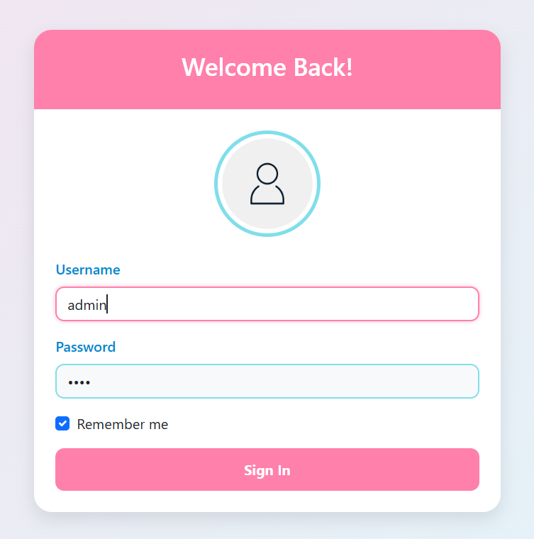
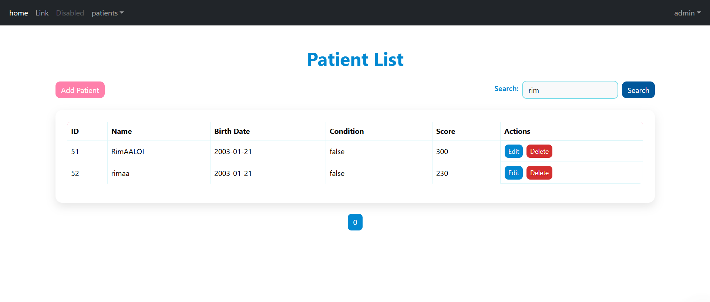

# 📌 Application Web JEE — HospitalAPP

Projet réalisé dans le cadre du cours de **Spring JEE** dispensé par **Prof. Mohamed YOUSSFI**.

## 💡 Description

Hospitalapp is a hospital management application developed with **Spring Boot**. This application allows managing patients, doctors, appointments, services, and treatments within a hospital. It uses **Spring Data JPA** for database management and **MySQL** as the relational database management system.

## 🚀 Features

- **Patient Management**: Add, modify, search, delete, and view patient information.
- **Doctor Management**: Add, modify, delete, and view doctor information.
- **Appointment Management**: Organize, modify, cancel, and view appointments between patients and doctors.
- **Service Management**: Add and manage available hospital services.

---

## 🛠️ Technologies Used

- **Java**: Main programming language.
- **Spring Boot**: Framework for building the web application.
- **Spring Data JPA**: Database access management.
- **MySQL**: Relational database management system.
- **Thymeleaf**: Template engine for the front-end.
- **Bootstrap**: For design.
- **Maven**: Dependency management and project build tool.
- **Git**: Version control for the source code.
....

## 📢 Notes

- 🚀 This project is under development. Currently, only **patient management** is implemented.  
- 🔧 Features for managing **doctors, appointments, and consultations** will be added soon.

---

## 🔐 Security

L’application intègre **Spring Security** pour sécuriser l’accès aux ressources et pages sensibles.

### 📌 Fonctionnalités :

- Page de connexion personnalisée
- Gestion des utilisateurs et mots de passe en mémoire *(dans cette version)*
- Attribution de rôles (`USER`, `ADMIN`)
- Protection des URL :
  - Les pages de gestion des patients accessibles uniquement après connexion
  - Redirection vers `/notauthorized` en cas d’accès non autorisé
  

## 📂 Project Structure


 ```

├───.idea
├───.mvn
│   └───wrapper
├───Screenshots
├───src
│   ├───main
│   │   ├───java
│   │   │   └───ma
│   │   │       └───enset
│   │   │           └───hospitalapp
│   │   │               ├───entities
│   │   │               ├───repository
│   │   │               ├───security
│   │   │               └───web
│   │   └───resources
│   │       ├───static
│   │       └───templates
│   └───test
│       └───java
│           └───ma
│               └───enset
│                   └───hospitalapp
└───target
    ├───classes
    │   ├───ma
    │   │   └───enset
    │   │       └───hospitalapp
    │   │           ├───entities
    │   │           ├───repository
    │   │           ├───security
    │   │           └───web
    │   └───templates
    ├───generated-sources
    │   └───annotations
    ├───generated-test-sources
    │   └───test-annotations
    └───test-classes
        └───ma
            └───enset
                └───hospitalapp


 ```

## 📸 Screenshots

Here are some screenshots of the app:

### 📊 **Page login**


*Caption: This is the login page secured with Spring Security.*
### 📊 **Patient List**
  

*Caption: The list of patients displayed with pagination and filtering options.*

### 🔍 **Search a Patient**
  
*Caption: The search screen allowing you to filter patients by name or other criteria.*

### ➕ **Add a Patient**
   
*Caption: The screen allowing you to add a new patient with a form.*

### ✏️ **Edit a Patient**
  
*Caption: The screen allowing you to edit an existing patient's information.*

### 🗑️ **Delete a Patient**
  
*Caption: The screen allowing you to delete a patient from the database.*

## 📸 Code Examples

### 🖥️ **Patient Class**
```
package ma.enset.hospitalapp.entities;

import jakarta.persistence.*;
import jakarta.validation.constraints.DecimalMin;
import jakarta.validation.constraints.NotEmpty;
import jakarta.validation.constraints.Size;
import lombok.AllArgsConstructor;
import lombok.Builder;
import lombok.Data;
import lombok.NoArgsConstructor;
import org.springframework.format.annotation.DateTimeFormat;

import java.util.Date;
@Entity

public class Patient {
    @Id @GeneratedValue(strategy = GenerationType.IDENTITY)
    private Long id ;
    @NotEmpty
    @Size(min=4,max=40)
    private String nom ;
    @Temporal(TemporalType.DATE)
    @DateTimeFormat(pattern = "yyyy-mm-dd")
    private Date dateNaissance;
    private boolean malade ;
    @DecimalMin(("100"))
    private int score ;

    public Long getId() {
        return id;
    }

    public String getNom() {
        return nom;
    }

    public Date getDateNaissance() {
        return dateNaissance;
    }

    public boolean isMalade() {
        return malade;
    }

    public int getScore() {
        return score;
    }

    public void setId(Long id) {
        this.id = id;
    }

    public void setNom(String nom) {
        this.nom = nom;
    }

    public void setDateNaissance(Date dateNaissance) {
        this.dateNaissance = dateNaissance;
    }

    public void setMalade(boolean malade) {
        this.malade = malade;
    }

    public void setScore(int score) {
        this.score = score;
    }

    public Patient(Long id, String nom, Date dateNaissance, boolean malade, int score) {
        this.id = id;
        this.nom = nom;
        this.dateNaissance = dateNaissance;
        this.malade = malade;
        this.score = score;
    }

    public Patient() {
    }
}

```

### 🖥️ ** PatientRepository Class**
```
package ma.enset.hospitalapp.repository;

import ma.enset.hospitalapp.entities.Patient;

import org.springframework.data.domain.Page;
import org.springframework.data.domain.Pageable;
import org.springframework.data.jpa.repository.JpaRepository;
import org.springframework.data.jpa.repository.Query;
import org.springframework.data.repository.query.Param;

public interface PatientRepository extends JpaRepository<Patient, Long> {
    Page<Patient> findByNomContains(String keyword, Pageable pageable);

    @Query("select p from Patient p where p.nom like %:x%")
    Page<Patient> chercher(@Param("x") String keyword, Pageable pageable);
}

```

### 🖥️ ** PatientController Class**
```
package ma.enset.hospitalapp.web;

import jakarta.validation.Valid;
import ma.enset.hospitalapp.entities.Patient;
import ma.enset.hospitalapp.repository.PatientRepository;
import org.springframework.beans.factory.annotation.Autowired;
import org.springframework.data.domain.Page;
import org.springframework.data.domain.PageRequest;
import org.springframework.data.domain.Sort;
import org.springframework.stereotype.Controller;
import org.springframework.ui.Model;
import org.springframework.validation.BindingResult;
import org.springframework.web.bind.annotation.GetMapping;
import org.springframework.web.bind.annotation.PostMapping;
import org.springframework.web.bind.annotation.RequestParam;

@Controller
public class PatientController {
    @Autowired
    private PatientRepository patientRepository;

    @GetMapping({"/index"})
    public String getpatient(Model model,
                             @RequestParam(name ="page",defaultValue = "0")int p,
                             @RequestParam(name = "size",defaultValue = "4")int s,
                             @RequestParam(name = "keyword",defaultValue = "")String kw) {
        Page<Patient> pagepatients;
        // Si le mot-clé est vide, récupérer tous les patients
        if (kw.isEmpty()) {
            pagepatients = patientRepository.findAll(PageRequest.of(p, s));
        } else {
            // Utiliser la méthode chercher pour rechercher par nom
            pagepatients = patientRepository.chercher(kw, PageRequest.of(p, s));
        }
        model.addAttribute("listpatients", pagepatients.getContent());
        model.addAttribute("pages",new int[pagepatients.getTotalPages()]);
        model.addAttribute("currentPage",p);
        model.addAttribute("keyword",kw);
        return "patients";
    }

    @GetMapping("/delete")
    public String eletepatient(@RequestParam Long id,
                                @RequestParam String keyword,
                                @RequestParam int page) {
        patientRepository.deleteById(id);
        return "redirect:/index?page=" + page + "&keyword=" + keyword;
    }

    @GetMapping("/formPatients")
    public String formPatients(Model model){
        model.addAttribute("patient",new Patient());
        return "formPatients";
    }
    @PostMapping(path = "/save")
    public String save(Model model, @Valid Patient patient, BindingResult bindingResult){
        if(bindingResult.hasErrors()) return "formPatients";
        patientRepository.save(patient);
        return "redirect:/index";
    }

    @GetMapping("/editPatient")
    public String editPatients(Model model,Long id,String keyword,int page){
        Patient patient=patientRepository.findById(id).orElse(null);
        if (patient==null) throw new RuntimeException("patient introvable");
        model.addAttribute("patient", patient);
        model.addAttribute("page",page);
        model.addAttribute("keyword",keyword);

        return "editpatient";
    }


}

```

### 🖥️ **Code for patients.html**
```
<!doctype html>
<html lang="en" xmlns:th="http://www.w3.org/1999/xhtml"
      xmlns:layout="http://www.ultraq.net.nz/thymeleaf/layout"
      layout:decorate="template1"  >

<head>
    <meta charset="utf-8">
    <meta name="viewport" content="width=device-width, initial-scale=1">
    <title>Clients</title>
    <link href="https://cdn.jsdelivr.net/npm/bootstrap@5.3.3/dist/css/bootstrap.min.css" rel="stylesheet" integrity="sha384-QWTKZyjpPEjISv5WaRU9OFeRpok6YctnYmDr5pNlyT2bRjXh0JMhjY6hW+ALEwIH" crossorigin="anonymous">
</head>
<body>
<div layout:fragment="content1">
<div class="container my-3">
    <h1 class="text-center mb-3">Liste des patients</h1>
    <form method="get" th:action="@{/index}">
        <label>Mot-clé :</label>
        <input type="text" name="keyword" th:value="${keyword}">
        <button type="submit" class="btn btn-info">Chercher</button>
    </form>


    <a class="btn btn-primary" th:href="@{/formPatients}">Nouveau patient</a>


    <table class="table">
        <thead>
        <tr>
            <th>ID</th>
            <th>Nom</th>
            <th>Date</th>
            <th>Malade</th>
            <th>Score</th>
            <th>Options</th>
        </tr>
        </thead>
        <tbody class="table-group-divide">
        <tr th:each="p:${listpatients}">
            <td th:text="${p.id}"></td>
            <td th:text="${p.nom}"></td>
            <td th:text="${p.dateNaissance}"></td>
            <td th:text="${p.malade}"></td>
            <td th:text="${p.score}"></td>
            <td style="white-space: nowrap">
                <a class="btn btn-success btn-sm" th:href="@{/editPatient(id=${p.id}, keyword=${keyword}, page=${currentPage})}">Modifier</a>
                <a class="btn btn-danger btn-sm" th:href="@{/delete(id=${p.id}, keyword=${keyword}, page=${currentPage})}" onclick="return confirm('Êtes-vous sûr ?')">Supprimer</a>
            </td>
        </tr>
        </tbody>
    </table>

    <ul class="nav nav-pills">
        <li th:each="page, status : ${pages}">
            <a th:href="@{/index(page=${status.index}, keyword=${keyword})}"
               th:class="${(currentPage == status.index) ? 'btn btn-info ms-1' : 'btn btn-outline-info ms-1'}"
               class="btn btn-outline-info" th:text="${status.index}"></a>
        </li>
    </ul>
</div>

<script src="https://cdn.jsdelivr.net/npm/bootstrap@5.3.3/dist/js/bootstrap.bundle.min.js" integrity="sha384-YvpcrYf0tY3lHB60NNkmXc5s9fDVZLESaAA55NDzOxhy9GkcIdslK1eN7N6jIeHz" crossorigin="anonymous"></script>
</div>
</body>
</html>

```
### 📄 Exemple de configuration `SecurityConfig.java` :

```
package ma.enset.hospitalapp.security;

import org.springframework.context.annotation.Bean;
import org.springframework.context.annotation.Configuration;
import org.springframework.security.config.annotation.web.builders.HttpSecurity;
import org.springframework.security.config.annotation.web.configuration.EnableWebSecurity;
import org.springframework.security.core.userdetails.User;
import org.springframework.security.crypto.password.PasswordEncoder;
import org.springframework.security.provisioning.InMemoryUserDetailsManager;
import org.springframework.security.web.SecurityFilterChain;

@Configuration
@EnableWebSecurity
public class SecurityConfig {

    @Bean
    public InMemoryUserDetailsManager inMemoryUserDetailsManager(PasswordEncoder passwordEncoder){
        String encodedPassword = passwordEncoder.encode("1234");
        System.out.println(encodedPassword);
        return new InMemoryUserDetailsManager(
                User.withUsername("user1").password(encodedPassword).roles("USER").build(),
                User.withUsername("user2").password(encodedPassword).roles("USER").build(),
                User.withUsername("admin").password(encodedPassword).roles("USER","ADMIN").build()
        );
    }
    @Bean
    public SecurityFilterChain securityFilterChain(HttpSecurity httpSecurity) throws Exception {
        return httpSecurity
                .formLogin(ar -> ar.loginPage("/login").defaultSuccessUrl("/").permitAll())

                .rememberMe(rm -> rm.key("remember-me-key") // Enables remember-me feature
                        .tokenValiditySeconds(40000) // Token valid for 1 day (optional)
                )
                .exceptionHandling(ar -> ar.accessDeniedPage("/notAuthorized"))
                .authorizeHttpRequests(ar->ar.requestMatchers("/deletePatient/**").hasRole("ADMIN"))
                .authorizeHttpRequests(ar->ar.requestMatchers("/admin/**").hasRole("ADMIN"))
                .authorizeHttpRequests(ar->ar.requestMatchers("/user/**").hasRole("USER"))
                .authorizeHttpRequests(ar->ar.anyRequest().authenticated())
                .build();
    }
}

```

---

## 🎥 Vidéos de Cours
Ces vidéos ont été réalisées par **Prof. Mohamed YOUSSFI** dans le cadre du cours de Spring Boot :

### 📌 Partie 1 : Application Web JEE avec Spring MVC, Thymeleaf et Spring Data JPA  
- [Introduction et Gestion des patients](https://www.youtube.com/watch?v=jDm-q-jEbiA)

### 📌 Partie 2 : Validation des formulaires et Template  
- [Création de pages template et validation](https://www.youtube.com/watch?v=eoBE745lDE0)

### 📌 Partie 3 : Sécurité avec Spring Security  

1. [InMemory Authentication](https://www.youtube.com/watch?v=7VqpC8UD1zM)
2. [JDBC Authentication](https://www.youtube.com/watch?v=Haz3wLiQ5-0)
3. [UserDetails Service](https://www.youtube.com/watch?v=RTiS9ygyYs4)

---

## ✅ Consignes

- Créer un repository GitHub
- Effectuer un commit et un push toutes les **30 minutes environ**
- Utiliser ce fichier `README.md` pour rédiger le rapport de projet
- Faire un dernier commit à la fin de la séance
- Poursuivre ensuite le développement et compléter l’activité pratique

---

## 📌 Auteur

- 👩‍💻 *Votre Nom*

---


## 💌 Author

👩‍💻 **Rim Aaloi**  
💌 Contact: [GitHub Profile](https://github.com/RimAaloi) | [LinkedIn](https://www.linkedin.com/in/rim-aaloi/)  

---

## 📚 Resources

- **Spring Documentation**: [https://spring.io/docs](https://spring.io/docs)
- **MySQL Documentation**: [https://dev.mysql.com/doc/](https://dev.mysql.com/doc/)
- **Bootstrap Documentation**: [https://getbootstrap.com/docs](https://getbootstrap.com/docs/)

---
